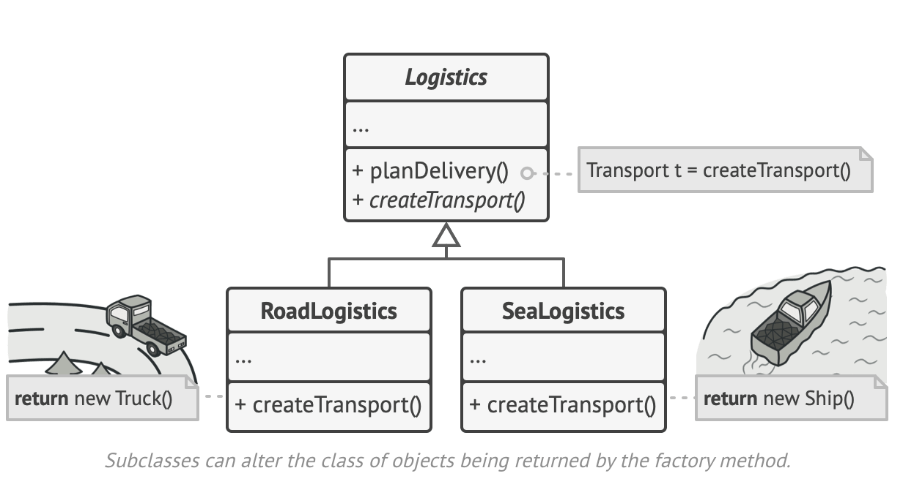
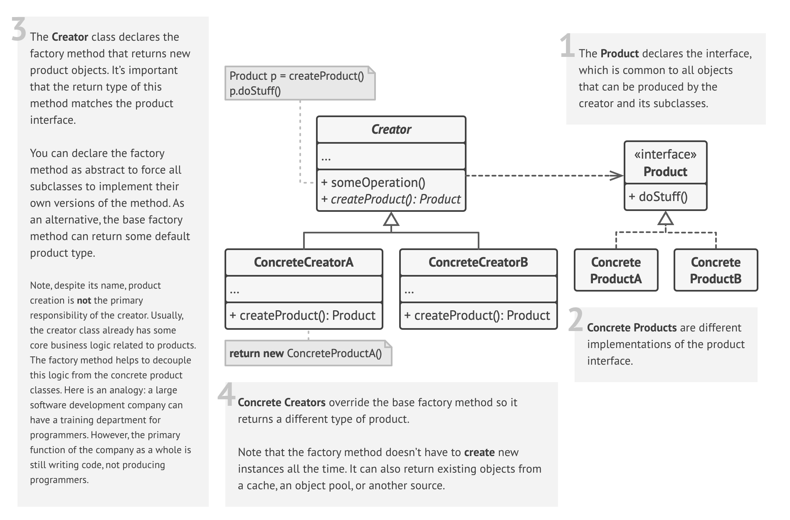

# Factory Method

Also known as: Virtual Constructor

https://refactoring.guru/design-patterns/factory-method

## Intent

`Factory Method` is a creational design pattern that provides an interface for creating objects in a `superclass`, but allows `subclasses` to alter the type of objects that will be created.

## Problem

When you need to add a new class to the program, but the rest of the code is already coupled to existing classes.

## Solution

The `Factory Method` pattern suggests that you replace direct object construction calls (using the new operator) with calls to a special factory method. 

Objects returned by a factory method are often referred to as products.

Now you can override the factory method in a subclass and change the class of products being created by the method.

There’s a slight limitation though: subclasses may return different types of products only if these products have a `common base class or interface`. 

Also, the factory method in the base class should have its return type declared as this interface.

## Structure

## Applicability

* Use the Factory Method when you don’t know beforehand the exact types and dependencies of the objects your code should work with.
  
  The Factory Method separates product construction code from the code that actually uses the product. Therefore it’s easier to extend the product construction code independently from the rest of the code.

  For example, to add a new product type to the app, you’ll only need to create a new creator subclass and override the factory method in it.
* Use the Factory Method when you want to provide users of your library or framework with a way to extend its internal components.
* Use the Factory Method when you want to save system resources by reusing existing objects instead of rebuilding them each time.

## How to Implement

* Make all products follow the same interface. This interface should declare methods that make sense in every product.

* Add an empty factory method inside the creator class. The return type of the method should match the common product interface.

* In the creator’s code find all references to product  constructors. One by one, replace them with calls to the factory method, while extracting the product creation code into the factory method.

  You might need to add a temporary parameter to the factory method to control the type of returned product.

  At this point, the code of the factory method may look pretty ugly. It may have a large switch operator that picks which product class to instantiate. But don’t worry, we’ll fix it soon enough.

* Now, create a set of creator subclasses for each type of product listed in the factory method. Override the factory method in the subclasses and extract the appropriate bits of construction code from the base method.

* If there are too many product types and it doesn’t make sense to create subclasses for all of them, you can reuse the control parameter from the base class in subclasses.

* If, after all of the extractions, the base factory method has become empty, you can make it abstract. If there’s something left, you can make it a default behavior of the method.

## Pros and Cons

Pros :

* You avoid tight coupling between the creator and the concrete products.
 
* Single Responsibility Principle. You can move the product creation code into one place in the program, making the code easier to support.
 
* Open/Closed Principle. You can introduce new types of products into the program without breaking existing client code.

Cons: 

* The code may become more complicated since you need to introduce a lot of new subclasses to implement the pattern. The best case scenario is when you’re introducing the pattern into an existing hierarchy of creator classes.
## Relations with Other Patterns

* Many designs start by using `Factory Method` (less complicated and more customizable via subclasses) and evolve toward `Abstract Factory`, `Prototype`, or `Builder` (more flexible, but more complicated).

* `Abstract Factory` classes are often based on a set of `Factory Methods`, but you can also use `Prototype` to compose the methods on these classes.

* You can use `Factory Method` along with `Iterator` to let collection subclasses return different types of iterators that are compatible with the collections.

* `Prototype` isn’t based on inheritance, so it doesn’t have its drawbacks. On the other hand, Prototype requires a complicated initialization of the cloned object. `Factory Method` is based on inheritance but doesn’t require an initialization step.

* `Factory Method` is a specialization of `Template Method`. At the same time, a Factory Method may serve as a step in a large Template Method.